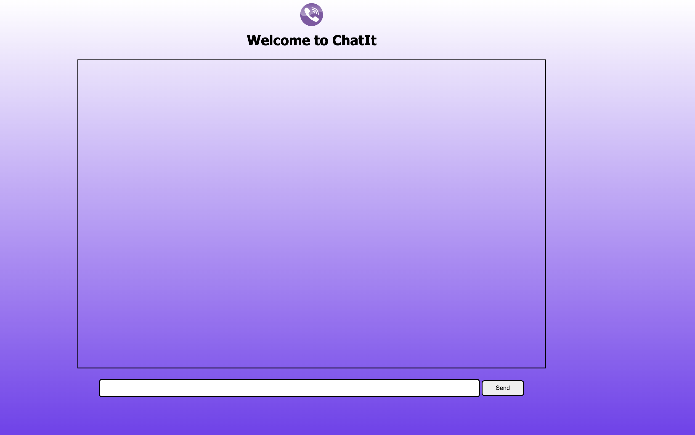
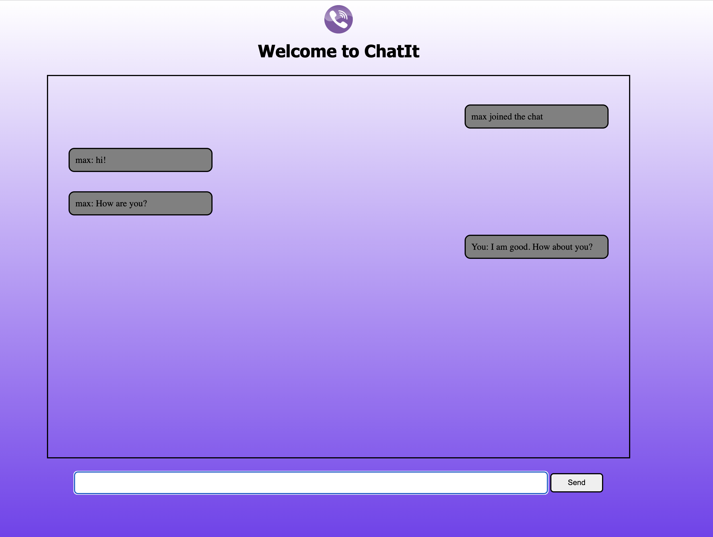

# 🌠 ChatIt 🌠


Real Time Chat Application created with  Express, Socket IO and HTML,CSS, Javascript.





### Tech Stack

| Technology | Description                                                                           | Link ↘️                 |
| ---------- | ------------------------------------------------------------------------------------- | ----------------------- |
| HTML5      | Hyper Text Markup Language                                                            | ----                    |
| CSS3       | Cascading Style Sheets                                                                | ----                    |
| JavaScript | High Level, Dynamic, Interpreted Language                                             | ----                    |
| NodeJS     | Open Source, Javascript Run Time Environment, Execute Javascript code for server side | https://nodejs.org/en/  |
| Express       | Web Framework for Node.js                                                          | https://expressjs.com/  |


### Running Locally

_Ensure [Node.js](https://nodejs.org/en/) and [NPM](https://www.npmjs.com/) are installed_

1. Clone or Download the repository (Depending on whether you are using SSH or HTTPS)

```bash
$ git clone git@github.com:sid6932/ChatApp.git
$ cd ChatApp
```

2. Install dependencies for root, client and server


3. Start the application

```bash
$ cd nodeServer
$ node index.js
```

Your app should now be running on [localhost:8080](localhost:8080).